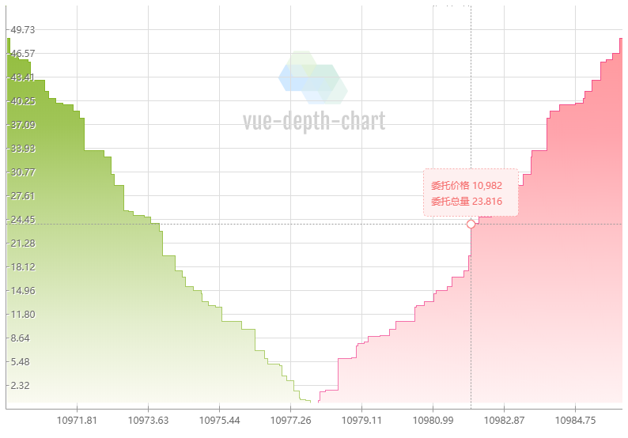
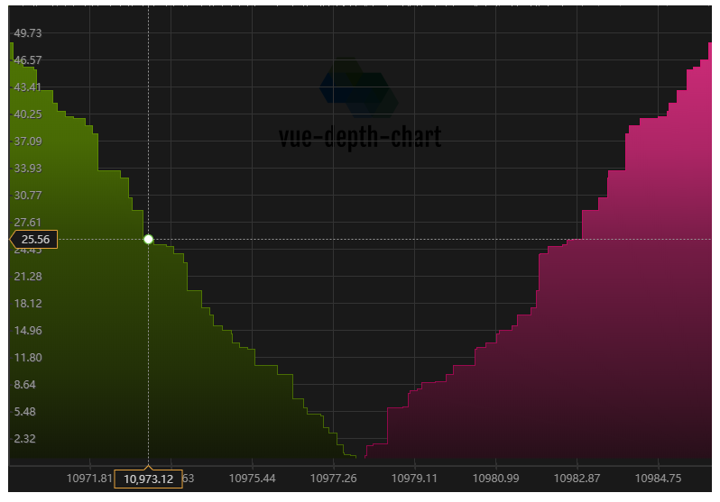

## Vue-Depth-Chart


基于Vue的可配置深度图

简体中文 | [English](https://github.com/xbc30/vue-depth-chart) | [文章](https://github.com/xbc30/vue-depth-chart/blob/master/article.md)

* 日间模式



* 夜间模式



### 安装

输入下面命令进行安装:

```javascript
npm i vue-depth-chart --save
```

### 使用

在```main.js```中全局引用```vue-depth-chart```，即可在任意组件中直接使用（注意要在组件中引入对应的css）

* main.js

```javascript
import Vue from 'vue'
import App from './App.vue'

import "vue-depth-chart"

Vue.config.productionTip = false

new Vue({
  render: h => h(App),
}).$mount('#app')

```

* App.vue

```Vue
<template>
  <div id="app">
    <vue-depth-chart :data="data" :customizeOptions="options" :theme="theme" />
  </div>
</template>

<script>

export default {
  name: "App",
  data() {
    return {
      options: {
        width: 780,
        height: 540,
      },
      theme: "day",
      data: {
        buy: [
          { price: 10977.76, amount: 0.303 },
          { price: 10977.63, amount: 0.462 },
          ...more items
        ],
        sell: [
          { price: 10986, amount: 52.896 },
          { price: 10985.91, amount: 48.57 },
          ...more items
        ],
      },
    };
  },
};
</script>
<style scoped>
@import "~vue-depth-chart/dist/vue-depth-chart.css";
</style>
```

#### 可配置选项

* 基础配置

| 选项 | 描述 | 日间模式 | 夜间模式 |
| :------| :------: | :------: | :------: |
| width  | 深度图可视宽 | ```780``` | ```780``` |
| height  | 深度图可视高 | ```540``` | ```540``` |
| initOffset  | 初始偏移，解决线条模糊 | ```0.5``` | ```0.5``` |
| bgColor  | 整体背景色 | ```rgba(255,255,255,0.1)``` | ```rgba(0,0,0,0.9)``` |

* 水印配置

| 选项 | 描述 | 日间模式 | 夜间模式 |
| :------| :------: | :------: | :------: |
| watermaskType  | 水印类型，可选```text```(文本) ```image```(图片) | ```image``` | ```image``` |
| watermaskContent  | 水印内容，当```watermaskType```=```text```时，应为具体文本字符串，当```watermaskType```=```image```时，应为对应图片base64字符串 | ```data:image/png;base64,..``` | ```data:image/png;base64,..``` |

* 线条配置

| 选项 | 描述 | 日间模式 | 夜间模式 |
| :------| :------: | :------: | :------: |
| gridLineColor  | 网格线条颜色 | ```#ddd``` | ```#333``` |
| rulerLineColor  | 标尺线条颜色颜色 | ```#999``` | ```rgb(47,47,47)``` |

* 轴配置

| 选项 | 描述 | 日间模式 | 夜间模式 |
| :------| :------: | :------: | :------: |
| xAxisGridSpace  | x轴背景网格间距 | ```90``` | ```90``` |
| yAxisGridSpace  | y轴背景网格间距 | ```30``` | ```30``` |
| xAxisFontColor  | x轴标尺刻度字体颜色 | ```#666``` | ```#999``` |
| yAxisFontColor  | y轴标尺刻度字体颜色 | ```#666``` | ```#999``` |
| xAxisFontSize  | x轴标尺刻度字体大小 | ```12px Aria``` | ```12px Aria``` |
| yAxisFontSize  | y轴标尺刻度字体大小 | ```12px``` | ```12px Aria``` |
| yAxisShadowColor  | y轴标尺刻度阴影颜色 | ```#fff``` | ```#333``` |

* 间距配置

| 选项 | 描述 | 日间模式 | 夜间模式 |
| :------| :------: | :------: | :------: |
| bottomSpace  | 深度图与y轴的间距 | ```8``` | ```8``` |
| buySellSpace  | 买卖单终点间距 | ```10``` | ```10``` |

* 提示框基本配置

| 选项 | 描述 | 日间模式 | 夜间模式 |
| :------| :------: | :------: | :------: |
| tipWidth  | 提示框宽度 | ```120``` | ```120``` |
| tipHeight  | 提示框高度 | ```60``` | ```60``` |
| tipLocationLineColor  | 提示框定位线条颜色 | ```#999``` | ```#999``` |
| tipLocationDotRadius  | 提示框圆点半径 | ```5``` | ```5``` |
| tipType  | 鼠标移动提示信息类型，```axis```(xy轴上) ```mouse```(跟随鼠标位置绝对定位显示) | ```mouse``` | ```mouse``` |

* 提示框 (买卖) 配置

| 选项 | 描述 | 日间模式 | 夜间模式 |
| :------| :------: | :------: | :------: |
| tipBuyLocationDotBgColor  | 买单提示框圆点背景颜色 | ```#fff``` | ```#fff``` |
| tipBuyBorderColor  | 买单提示框边框颜色 | ```#67c23a``` | ```#67c23a``` |
| tipBuyBgColor  | 买单提示框背景色 | ```#f0f9eb``` | ```#f0f9eb``` |
| tipBuyTextColor  | 买单提示框提示文字颜色 | ```#67c23a``` | ```#67c23a``` |
| tipSellLocationDotBgColor  | 卖单提示框圆点背景颜色 | ```#fff``` | ```#fff``` |
| tipSellBorderColor  | 卖单提示框边框颜色 | ```#f56c6c``` | ```#f56c6c``` |
| tipSellBgColor  | 卖单提示框背景色 | ```#fef0f0``` | ```#fef0f0``` |
| tipSellTextColor  | 卖单提示框提示文字颜色 | ```#f56c6c``` | ```#f56c6c``` |

* 买卖笔触和填充配置

| 选项 | 描述 | 日间模式 | 夜间模式 |
| :------| :------: | :------: | :------: |
| buyStrokeColor  | 买单笔触颜色 | ```rgb(111,168,0)``` | ```rgb(111,168,0)``` |
| sellStrokeColor  | 卖单笔触颜色 | ```rgb(234,0,112)``` | ```rgb(234,0,112)``` |
| buyLinearGradientArray | 买单填充渐变数组（上到下 ）| ```["rgb(141,186,51)", "rgb(160,197,87)", "rgb(189,215,138)", "rgb(228,238,206)", "rgb(250,250,241)"]``` | ```["rgb(80,120,3)", "rgb(72,106,4)", "rgb(51,74,5)", "rgb(35,49,7)", "rgb(20,25,8)"]``` |
| sellLinearGradientArray | 卖单填充渐变数组（上到下 ）| ```["rgb(255,148,152)", "rgb(255,164,172)", "rgb(255,192,197)", "rgb(255,228,230)", "rgb(255,249,249)"]``` | ```["rgb(217,45,127)", "rgb(172,37,101)", "rgb(115,27,68)", "rgb(64,19,39)", "rgb(26,13,18)"]``` |
