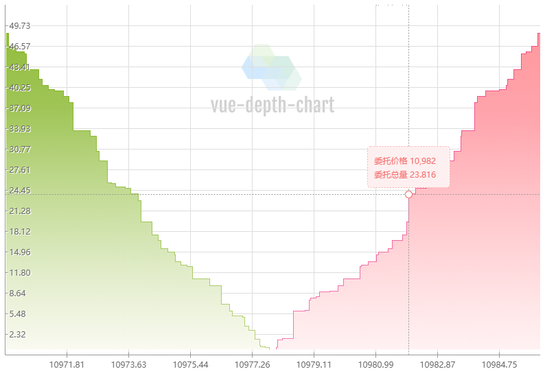
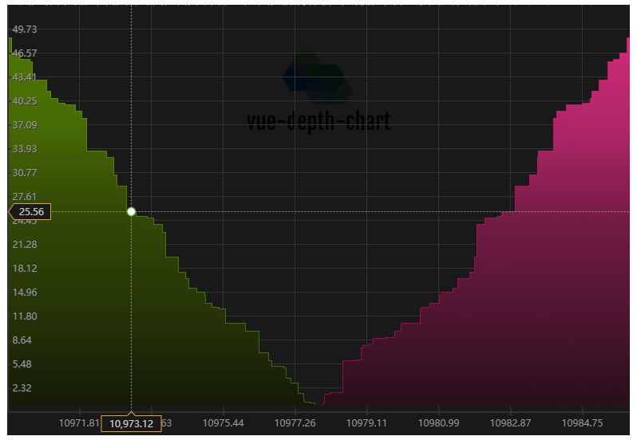
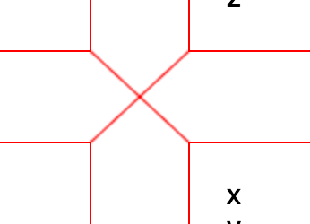
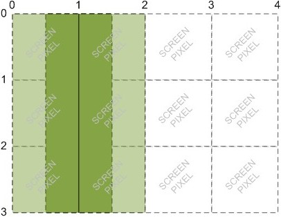
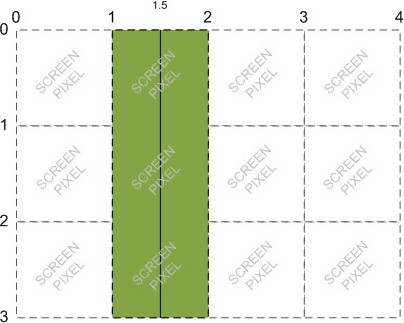

## Vue深度图组件


### 前言

深度图在各大常用chart类库上并不常见，自己着手弄了一个可以根据配置项自定义的深度图组件，并将其作为一个Vue组件发布出来，以下便是开发过程的分享

### 项目

#### 项目github链接

[github.com/xbc30/vue-depth-chart](https://github.com/xbc30/vue-depth-chart)

#### 亮点

* 解决Canvas绘制1像素模糊问题
* 可添加文字水印和图片水印
* 图配置选项达三十多项，可随心所欲地定制自己的深度图
* 提供日间模式和夜间模式的默认配置
* 友好的滑动提示框信息，可以切换不同风格的提示框
* 监听data的变化，实时渲染最新的深度图

#### 总体效果

* 日间模式



* 夜间模式



### Canvas基础知识点

组件用到了Canvas以下属性和方法，先来熟悉一下

* 属性

| 方法 | 作用 |
| :------ | :------: |
| lineWidth | 设置线条宽度 |
| lineJoin | 设置线条交汇的形态 |
| fillStyle | 设置填充颜色 |
| strokeStyle | 设置笔触颜色 |
| font | 设置字体大小 | 
| textAlign | 设置字体居中或偏左右 |
| globalAlpha | 设置透明度 |

* 方法

| 方法 | 用途 | 
| :------ | :------: |
| beginPath() | 开始一条路径 |
| closePath() | 结束一条路径 |
| translate() | 重新映射画布上的 (0,0) 位置 |
| setLineDash() | 绘制虚线 |
| moveTo() | 移动到指定位置 |
| lineTo() | 创建到指定位置的线条 |
| stroke() | 绘制确切的路径 |
| clearRect() | 清空一个矩形 |
| fill() | 填充闭合路径形成的空间 |
| fillRect() | 填充一个矩形 |
| arc() | 绘制圆 |
| arcTo() | 绘制切线圆弧 |
| measureText() | 检查字体的宽度 |
| fillText() | 绘制填色的文本 |
| drawImage() | 绘制图片 |
| save() | 保存当前的绘图状态 |
| restore() | 恢复之前保存的绘图状态 |

Canvas绘制会有很多小技巧，简单分享以下几点：

* 线条模糊问题

当我们在canvas画布绘制线条时，常常遇到下面这种情况，有些线条过度模糊，给图表整体带来很强的劣质感



解决绘制线条模糊的问题，常在绘制之前进行0.5像素的偏移

```javascript
context.translate(0.5, 0.5);
```

**原因：** 我们将每个像素想象成一​​个大正方形，整数坐标（0，1，2…）是正方形的边缘。如果您在整数坐标之间绘制一个单位宽的线，它将与像素正方形的相对边重叠，并且所生成的线将被绘制两个像素宽。要绘制仅一个像素宽的线，你需要将坐标垂直于该线的方向偏移0.5。

**例如：** 如果您尝试从画一条线(1, 0)来(1, 3)，浏览器将利用覆盖在两侧的0.5屏幕像素的线x=1。屏幕无法显示半个像素，因此它将行扩展到总共两个像素：



但是，如果你尝试从画一条线(1.5, 0)来(1.5, 3)，浏览器将利用覆盖在两侧的0.5屏幕像素线x=1.5，这导致真正的1个像素宽的线：



当你已经进行偏移的时候，还要特别注意确保你的所有坐标点是整数，否则HTML5会自动实现边缘反锯齿

* 文字居中

设置```textAlign```为```center```即可实现任意长度的文本居中显示

```javascript
const text = "vue-depth-chart";
context.textAlign = "center";
context.fillText(text, x, y);
```

* 圆角矩形

绘制圆角矩阵的话，熟悉```arcTo()```绘制原理就能快速弄出来

```javascript
drawRoundedRect(context, x, y, width, height, r, fill, stroke) {
    context.moveTo(x + r, y);
    context.arcTo(x + width, y, x + width, y + r, r); // draw right side and bottom right corner
    context.arcTo(x + width, y + height, x + width - r, y + height, r); // draw bottom and bottom left corner
    context.arcTo(x, y + height, x, y + height - r, r); // draw left and top left corner
    context.arcTo(x, y, x + r, y, r);
    if (fill) {
    context.fill();
    }
    if (stroke) {
    context.stroke();
    }
}
```

### 开发流程

#### 1.绘制水印

* 文本水印

跟普通的绘制文本没有本质区别，只是```fillStyle```需要设置比较低的透明度

```javascript
const watermaskContentWidth = context.measureText(watermaskContent).width;
context.font = "22px Aria";
context.textAlign = "center";
context.fillStyle = "rgba(100,100,100,0.1)";
context.fillText(
    watermaskContent,
    width / 2,
    50,
    watermaskContentWidth
);
```

效果如下：


* 图片水印

绘制图片```drawImage()```第一个参数需要提供```CSSImageValue``` or ```HTMLImageElement```，这里父子组件传递```Element```比较难搞，所以设置成了传递```base64```来构建一个```Image```对象，以完成图片水印的渲染

```javascript
const watermaskImage = new Image();
watermaskImage.src = watermaskContent; // watermaskContent为base64 string
watermaskImage.onload = () => {
    context.drawImage(
    watermaskImage,
    (width - watermaskImage.width) / 2,
    10,
    watermaskImage.width,
    watermaskImage.height
    );
};
if (this.theme == "night") {
    context.globalAlpha = 1;
} else {
    context.globalAlpha = 0.2;
}
```

效果如下：


#### 2.绘制网格

根据配置中的网格间距来确定水平和垂直方向的绘制路径

```javascript
drawGrid(context, options) {
    const {
        width,
        height,
        initOffset,
        bgColor,
        xAxisGridSpace,
        yAxisGridSpace,
        gridLineColor,
    } = options;
    context.beginPath();

    // 创建垂直格网线路径
    for (
        let i = initOffset + xAxisGridSpace;
        i < width;
        i += xAxisGridSpace
    ) {
        context.moveTo(i, 0);
        context.lineTo(i, height - yAxisGridSpace); // 不穿出
    }
    // 创建水平格网线路径
    for (
        let j = initOffset + yAxisGridSpace;
        j < height;
        j += yAxisGridSpace
    ) {
        context.moveTo(0, j);
        context.lineTo(width, j);
    }

    // 设置绘制颜色
    context.strokeStyle = gridLineColor;
    // 设置绘制线段的宽度
    context.lineWidth = 1;
    context.fillStyle = bgColor;
    context.fillRect(0, 0, width, height);
    // 绘制格网
    context.stroke();
    context.closePath();
}
```

效果如下：


#### 3.绘制主深度图

绘制主图需要结合买卖单具体数据来确定绘制的点坐标

```javascript
drawDepth(data, context, options) {
    // 判断是否有对应的深度数组
    if (
        !Object.prototype.hasOwnProperty.call(data, "buy") ||
        !Object.prototype.hasOwnProperty.call(data, "sell")
    ) {
        alert("无法渲染深度图，缺少关键数组(买单或卖单)");
        return;
    }
    // 初始化基本数据
    const {
        width,
        height,
        initOffset,
        bottomSpace,
        buySellSpace,
        yAxisGridSpace,
        buyLinearGradientArray,
        sellLinearGradientArray,
    } = options;
    const allwidth = width; // 整体宽度
    const allheight = height - yAxisGridSpace;
    const staticWidth = (allwidth - buySellSpace) / 2; // 固定单边宽度
    const staticHeight = allheight - bottomSpace;
    const buyPoint = [],
    sellPoint = [];
    const allData = this.deepClone(data)
    const buyOriginData = allData["buy"];
    const buyData = buyOriginData.reverse();
    const sellData = data["sell"];
    const buyLen = buyData.length;
    const sellLen = sellData.length;

    const buyEndOrigin = { x: staticWidth, y: staticHeight }; // 买单画笔终点
    const sellEndOrigin = { x: staticWidth + buySellSpace, y: staticHeight }; // 卖单画笔终点
    const buyStartOrigin = { x: 0, y: staticHeight }; // 买单画笔边缘起点
    const sellStartOrigin = { x: width, y: staticHeight }; // 卖单画笔边缘起点
    const buySidePrice = buyData[0].price; // 买单边缘价格
    const sellSidePrice = sellData[0].price; // 买单边缘价格
    const buyTotalAmount = buyData[0].amount; // 买单全部深度数量
    const sellTotalAmount = sellData[0].amount; // 卖单全部深度数量
    const totalAmount = Math.max(buyTotalAmount, sellTotalAmount); // 确定最大高度对应的数量
    const buyMaxPriceDiff = buyData[buyLen - 1].price - buyData[0].price; // 买单最大价差
    const sellMaxPriceDiff = sellData[0].price - sellData[sellLen - 1].price; // 卖单最大价差
    let pointList = [];
    // 添加买单画点 并确保坐标点均为整数
    buyData.forEach((item, index) => {
        const x = Math.round(
            ((item.price - buySidePrice) / buyMaxPriceDiff) * staticWidth
        );
        const y = Math.round(
            ((totalAmount - item.amount) / totalAmount) * staticHeight
        );
        buyPoint.push({ x, y });

        if (buyData[index + 1]) {
            const yDrop = Math.round(
            ((totalAmount - buyData[index + 1].amount) / totalAmount) *
                staticHeight
            );
            buyPoint.push({ x, y: yDrop });
        }
        pointList.push({ x, y, side: "buy", value: item });
    });
    // 添加卖单画点 并确保坐标点均为整数
    sellData.forEach((item, index) => {
        const x = Math.round(
            width -
            ((sellSidePrice - item.price) / sellMaxPriceDiff) * staticWidth
        );
        const y = Math.round(
            ((totalAmount - item.amount) / totalAmount) * staticHeight
        );
        sellPoint.push({ x, y });
        // 下落点
        if (sellData[index + 1]) {
            const yDrop = Math.round(
            ((totalAmount - sellData[index + 1].amount) / totalAmount) *
                staticHeight
            );
            sellPoint.push({ x, y: yDrop });
        }
        pointList.push({ x, y, side: "sell", value: item });
    });
    pointList = pointList.sort((a, b) => {
        return a.x - b.x;
    });
    pointList.forEach((item) => {
        this.pointMap.set([item.x, item.y, item.side], item.value);
    });

    buyPoint.push(buyEndOrigin);
    buyPoint.push(buyStartOrigin);
    sellPoint.push(sellEndOrigin);
    sellPoint.push(sellStartOrigin);
    // 初始化中心偏移，确保无锯齿化地画线
    context.clearRect(0, 0, width, height);
    context.save();
    context.translate(initOffset, initOffset);
    context.lineWidth = 1; // 因为已经中心偏移，所以不需要设为0.5，设为0.5又会产生锯齿
    context.lineJoin = "bevel"; // 线条和线条相交的时候所呈现出的形态设为"斜接（不会延长形成尖角）"

    // 买单笔触画线
    context.beginPath();
    // 设置买单渐变填充和笔触颜色
    const buyLinearGradient = context.createLinearGradient(
        0,
        0,
        0,
        staticHeight
    );
    buyLinearGradient.addColorStop(0, buyLinearGradientArray[0]);
    buyLinearGradient.addColorStop(0.3, buyLinearGradientArray[1]);
    buyLinearGradient.addColorStop(0.5, buyLinearGradientArray[2]);
    buyLinearGradient.addColorStop(0.8, buyLinearGradientArray[3]);
    buyLinearGradient.addColorStop(1, buyLinearGradientArray[4]);
    context.strokeStyle = this.options.buyStrokeColor;
    context.fillStyle = buyLinearGradient;
    // 连接对应的点
    buyPoint.forEach((item, index) => {
        context.lineTo(item.x, item.y);
        if (index !== buyPoint.length - 1) {
          context.stroke();
        }
    });
    context.fill();
    context.closePath();

    // 卖单笔触画线
    context.beginPath();
    // 设置卖单渐变填充和笔触颜色
    const sellLinearGradient = context.createLinearGradient(0, 0, 0, height);
    sellLinearGradient.addColorStop(0, sellLinearGradientArray[0]);
    sellLinearGradient.addColorStop(0.3, sellLinearGradientArray[1]);
    sellLinearGradient.addColorStop(0.5, sellLinearGradientArray[2]);
    sellLinearGradient.addColorStop(0.8, sellLinearGradientArray[3]);
    sellLinearGradient.addColorStop(1, sellLinearGradientArray[4]);
    context.fillStyle = sellLinearGradient;
    context.strokeStyle = this.options.sellStrokeColor;
    // 连接对应的点
    sellPoint.forEach((item, index) => {
        context.lineTo(item.x, item.y);
        if (index !== sellPoint.length - 1) {
          context.stroke();
        }
    });
    context.fill();
    context.closePath();

    context.restore();
}
```

效果如下：


#### 4.绘制坐标轴

```javascript
drawAxis(data, context, options) {
    // 判断是否有对应的深度数组
    if (
        !Object.prototype.hasOwnProperty.call(data, "buy") ||
        !Object.prototype.hasOwnProperty.call(data, "sell")
    ) {
        alert("无法渲染坐标刻度，缺少关键数组(买单或卖单)");
        return;
    }
    const {
        width,
        height,
        initOffset,
        bottomSpace,
        buySellSpace,
        xAxisGridSpace,
        yAxisGridSpace,
        rulerLineColor,
        xAxisFontSize,
        yAxisFontSize,
        xAxisFontColor,
        yAxisFontColor,
        yAxisShadowColor,
    } = options;
    const yLen = height - yAxisGridSpace;
    const origin = [0, yLen];
    const allData = this.deepClone(data)
    const buyOriginData = allData["buy"];
    const buyData = buyOriginData.reverse();
    const sellData = data["sell"];
    const buyLen = buyData.length;
    const sellLen = sellData.length;
    const buyBasePrice = buyData[buyLen - 1].price;
    const sellBasePrice = sellData[sellLen - 1].price;
    const buyPriceDiff = buyData[0].price - buyData[buyLen - 1].price;
    const sellPriceDiff = sellData[0].price - sellData[sellLen - 1].price;
    const staticWidth = (width - buySellSpace) / 2; // 单边宽度
    const staticHeight = yLen - bottomSpace;
    const buyTotalAmount = buyData[0].amount; // 买单全部深度数量
    const sellTotalAmount = sellData[0].amount; // 卖单全部深度数量
    const totalAmount = Math.max(buyTotalAmount, sellTotalAmount); // 确定最大高度对应的数量

    context.clearRect(0, 0, width, height);
    context.save();
    context.translate(initOffset, initOffset);
    context.beginPath();

    // 创建水平坐标轴路径
    context.moveTo(origin[0], origin[1]);
    context.lineTo(origin[0] + width, origin[1]);

    // 创建垂直坐标轴路径
    context.moveTo(origin[0], origin[1]);
    context.lineTo(origin[0], origin[1] - yLen);

    // 创建y坐标轴的刻度线路径
    for (let i = origin[0] + xAxisGridSpace; i < width; i += xAxisGridSpace) {
        context.moveTo(i, origin[1] - 4);
        context.lineTo(i, origin[1] + 4);
        context.font = xAxisFontSize;
        context.fillStyle = xAxisFontColor;
        // 设置居中
        context.textAlign = "center";

        let number = 0;
        if (i <= staticWidth) {
          number = parseFloat(
            (i / staticWidth) * buyPriceDiff + buyBasePrice
          ).toFixed(2);
        } else if (i > staticWidth + buySellSpace) {
          number = parseFloat(
            ((i - (staticWidth + buySellSpace)) / staticWidth) * sellPriceDiff +
              sellBasePrice
          ).toFixed(2);
        } else {
          number = null;
        }

        // maxWidth 为间距
        context.fillText(number, i, origin[1] + 18, xAxisGridSpace);
    }

    for (
        let j = origin[1] - yAxisGridSpace;
        j > origin[1] - yLen;
        j -= yAxisGridSpace
    ) {
        context.moveTo(origin[0] - 4, j);
        context.lineTo(origin[0] + 4, j);
        context.font = yAxisFontSize;
        context.fillStyle = yAxisFontColor;
        context.textAlign = "left";
        context.shadowOffsetX = 1;
        context.shadowOffsetY = 1;
        context.shadowColor = yAxisShadowColor;

        const number = parseFloat(
          ((staticHeight - j) / staticHeight) * totalAmount
        ).toFixed(2);

        context.fillText(number, origin[0] + 6, j + 4);
    }

    // 设置绘制颜色
    context.strokeStyle = rulerLineColor;
    // 设置绘制线段的宽度
    context.lineWidth = 1;
    // 绘制坐标轴
    context.stroke();
    context.closePath();
    context.restore();
}
```

效果如下：


#### 5.绘制提示框

提示框提供了两种样式

* 跟随圆点的提示框

```javascript
tipContext.beginPath();
tipContext.fillStyle =
    side === "buy" ? tipBuyBgColor : tipSellBgColor;
tipContext.font = "12px bold";
let left = x - tipWidth / 2;
let top = y - tipHeight - 10;
const tipsPriceText = `委托价格 ${this.toThousand(obj.price)}`;
const tipsAmountText = `委托总量 ${this.toThousand(obj.amount)}`;
const maxTextWidth = Math.max(
    tipContext.measureText(tipsPriceText).width,
    tipContext.measureText(tipsAmountText).width
);
if (maxTextWidth + 20 > tipWidth) {
    tipWidth = maxTextWidth + 20;
}
if (left < initOffset) {
    left = initOffset;
}
if (left >= width - tipWidth) {
    left = width - tipWidth;
}
if (top <= 0) {
    top = y + 10;
}
tipContext.lineWidth = 1;
tipContext.setLineDash([2]);
tipContext.lineJoin = "round";
tipContext.strokeStyle =
    side === "buy" ? tipBuyBorderColor : tipSellBorderColor;
this.drawRoundedRect(
    tipContext,
    left,
    top,
    tipWidth,
    tipHeight,
    5,
    false,
    true
);
tipContext.fillStyle =
    side === "buy" ? tipBuyBgColor : tipSellBgColor;
tipContext.fill();

// tipContext.fillRect(left, top, tipWidth, tipHeight);
tipContext.fillStyle =
    side === "buy" ? tipBuyTextColor : tipSellTextColor;
tipContext.textAlign = "left";
tipContext.shadowBlur = 0;
const marginLeft = 10;
const marginTop = 25;
const lineHeight = 20;
tipContext.fillText(
    tipsPriceText,
    left + marginLeft,
    top + marginTop
);
tipContext.fillText(
    tipsAmountText,
    left + marginLeft,
    top + marginTop + lineHeight
);
tipContext.closePath();
```

效果如下：


* 坐标轴上的提示框

```javascript
const tipsPriceText = `${this.toThousand(obj.price)}`;
const tipsAmountText = `${obj.amount}`;
const tipsPriceWidth =
    tipContext.measureText(tipsPriceText).width + 20;
const tipsAmountWidth =
    tipContext.measureText(tipsAmountText).width + 15;
const lineHeight = 20;
// 绘制x轴上的提示框
tipContext.beginPath();
tipContext.fillStyle = "#fff";
tipContext.lineWidth = 1;
tipContext.lineJoin = "round";
tipContext.strokeStyle = "#e6a23c";
tipContext.moveTo(x, height);
tipContext.lineTo(x - 5, height + 5);
tipContext.lineTo(x - tipsPriceWidth / 2, height + 5);
tipContext.lineTo(x - tipsPriceWidth / 2, height + 5 + lineHeight);
tipContext.lineTo(x + tipsPriceWidth / 2, height + 5 + lineHeight);
tipContext.lineTo(x + tipsPriceWidth / 2, height + 5);
tipContext.lineTo(x + 5, height + 5);
tipContext.lineTo(x, height);
if (this.theme == "night") {
    tipContext.fillStyle = "rgb(25,25,25)";
} else {
    tipContext.fillStyle = "#fff";
}
tipContext.fill();
tipContext.stroke();
if (this.theme == "night") {
    tipContext.fillStyle = "#ccc";
} else {
    tipContext.fillStyle = "#666";
}
tipContext.font = "12px bold";
tipContext.textAlign = "center";
tipContext.fillText(tipsPriceText, x, height + 19);
tipContext.closePath();
// 绘制y轴上的提示框
tipContext.beginPath();
tipContext.fillStyle = "#fff";
tipContext.lineWidth = 1;
tipContext.lineJoin = "round";
tipContext.strokeStyle = "#e6a23c";
tipContext.moveTo(1, y);
tipContext.lineTo(8, y - 10);
tipContext.lineTo(8 + tipsAmountWidth, y - 10);
tipContext.lineTo(8 + tipsAmountWidth, y + 10);
tipContext.lineTo(8, y + 10);
tipContext.lineTo(1, y);
if (this.theme == "night") {
    tipContext.fillStyle = "rgb(25,25,25)";
} else {
    tipContext.fillStyle = "#fff";
}
tipContext.fill();
tipContext.stroke();
if (this.theme == "night") {
    tipContext.fillStyle = "#ccc";
} else {
    tipContext.fillStyle = "#666";
}
tipContext.font = "12px bold";
tipContext.textAlign = "center";
tipContext.fillText(tipsAmountText, 30, y + 4, tipsAmountWidth);
tipContext.closePath();
```

效果如下：


### 其他要点

1. 父组件配置覆盖

父组件往子组件传递props，以覆盖子组件的默认配置

```html
<!-- 父组件 -->
<vue-depth-chart :data="data" :customizeOptions="options" :theme="theme" />
```

子组件通过```Object.assign()```合并配置，这样通过访问```this.options```即可获取正确的配置了

```javascript
// 子组件覆盖方式
const defaultDayOptions = {...};

export default {
    props: {
        customizeOptions: {
            type: [Object],
            default() {
                return defaultDayOptions;
            },
        }
    },
    data() {
        return {
            options: Object.assign(defaultDayOptions, this.customizeOptions),
        }
    }
}
```

2. watch

深度图数据会随时变化，这里使用了```watch```来响应数据的变化，当```data```第一次绑定的时候，不需要去执行监听函数，所以设置```immediate```为```false```，同时我们监听的是```data```中的属性值，所以设置```deep```为```true```，每次数据响应都需要去同时重新渲染深度图和坐标系，对应```drawDepth```和```drawAxis```

```javascript
watch: {
    data: {
        handler(val) {
            this.pointMap = new Map();
            this.drawDepth(val, this.depthContext, this.options);
            this.drawAxis(val, this.axisContext, this.options);
        },
        immediate: false,
        deep: true,
    },
}
```

> **注意：** 在```watch```的```handle```中，```drawDepth```和```drawAxis```使用了```val```，而这里的```val```又是引用对象，所以如果在```drawDepth```和```drawAxis```直接操作```val```的话，就会引起```you may have an infinite update loop in watcher with expression```这种报错，使得```val```陷入了无限死循环中，因此在```drawDepth```和```drawAxis```可以使用深拷贝赋值来解决这类问题

效果如下：


3. 发布一个vue组件

将开发好的```vue-depth-chart.vue```置于```src/components```目录下，同时在该目录下新建一个```index.js```文件，用来注册Vue组件

```javascript
// src/components/index.js
import Vue from "vue";
import VueDepthChart from "./vue-depth-chart.vue";

const Components = {
    VueDepthChart
};

Object.keys(Components).forEach(name => {
    Vue.component(name, Components[name]);
});

export default Components;
```

修改一下项目的主入口```main.js```

```javascript
import Vue from 'vue'
import App from './App.vue'

import "./components"

Vue.config.productionTip = false

new Vue({
  render: h => h(App),
}).$mount('#app')
```

接下来，需要对这个组件进行打包。这里我们可以使用@vue/cli 3.0自带的打包功能。打开```package.json```文件，在```scripts```中增加一项：

```javascript
"scripts": {
    "package": "vue-cli-service build --target lib --name vue-depth-chart ./src/components/index.js"
},
```

接下来，需要将```package.json```中的```main```字段指向刚刚生成的库文件。这里以```commonjs```为例（umd应该也是没问题的）：

```javascript
{
  "main": "./dist/vue-depth-chart.common.js",
}
```

然后，我们需要在```package.json```的```files```字段中声明这个组件库项目需要包含的文件：

```javascript
{
  "files": [
    "dist/*",
    "src/*",
    "images/*",
    "*.json",
    "*.js"
  ]
}
```

这样，命令行运行```npm run package```即可完成项目组件的打包，最后操作```npm login```和```npm publish```就能完成组件发布。

### 安装

输入下面命令进行安装:

```javascript
npm i vue-depth-chart --save
```

### 使用

在```main.js```中全局引用```vue-depth-chart```，即可在任意组件中直接使用（注意要在组件中引入对应的css）

* main.js

```javascript
import Vue from 'vue'
import App from './App.vue'

import "vue-depth-chart"

Vue.config.productionTip = false

new Vue({
  render: h => h(App),
}).$mount('#app')

```

* App.vue

```Vue
<template>
  <div id="app">
    <vue-depth-chart :data="data" :customizeOptions="options" :theme="theme" />
  </div>
</template>

<script>

export default {
  name: "App",
  data() {
    return {
      options: {
        width: 780,
        height: 540,
      },
      theme: "day",
      data: {
        buy: [
          { price: 10977.76, amount: 0.303 },
          { price: 10977.63, amount: 0.462 },
          ...more items
        ],
        sell: [
          { price: 10986, amount: 52.896 },
          { price: 10985.91, amount: 48.57 },
          ...more items
        ],
      },
    };
  },
};
</script>
<style scoped>
@import "~vue-depth-chart/dist/vue-depth-chart.css";
</style>
```

### 可配置选项

* 基础配置

| 选项 | 描述 | 日间模式 | 夜间模式 |
| :------| :------: | :------: | :------: |
| width  | 深度图可视宽 | ```780``` | ```780``` |
| height  | 深度图可视高 | ```540``` | ```540``` |
| initOffset  | 初始偏移，解决线条模糊 | ```0.5``` | ```0.5``` |
| bgColor  | 整体背景色 | ```rgba(255,255,255,0.1)``` | ```rgba(0,0,0,0.9)``` |

* 水印配置

| 选项 | 描述 | 日间模式 | 夜间模式 |
| :------| :------: | :------: | :------: |
| watermaskType  | 水印类型，可选```text```(文本) ```image```(图片) | ```image``` | ```image``` |
| watermaskContent  | 水印内容，当```watermaskType```=```text```时，应为具体文本字符串，当```watermaskType```=```image```时，应为对应图片base64字符串 | ```data:image/png;base64,..``` | ```data:image/png;base64,..``` |

* 线条配置

| 选项 | 描述 | 日间模式 | 夜间模式 |
| :------| :------: | :------: | :------: |
| gridLineColor  | 网格线条颜色 | ```#ddd``` | ```#333``` |
| rulerLineColor  | 标尺线条颜色颜色 | ```#999``` | ```rgb(47,47,47)``` |

* 轴配置

| 选项 | 描述 | 日间模式 | 夜间模式 |
| :------| :------: | :------: | :------: |
| xAxisGridSpace  | x轴背景网格间距 | ```90``` | ```90``` |
| yAxisGridSpace  | y轴背景网格间距 | ```30``` | ```30``` |
| xAxisFontColor  | x轴标尺刻度字体颜色 | ```#666``` | ```#999``` |
| yAxisFontColor  | y轴标尺刻度字体颜色 | ```#666``` | ```#999``` |
| xAxisFontSize  | x轴标尺刻度字体大小 | ```12px Aria``` | ```12px Aria``` |
| yAxisFontSize  | y轴标尺刻度字体大小 | ```12px``` | ```12px Aria``` |
| yAxisShadowColor  | y轴标尺刻度阴影颜色 | ```#fff``` | ```#333``` |

* 间距配置

| 选项 | 描述 | 日间模式 | 夜间模式 |
| :------| :------: | :------: | :------: |
| bottomSpace  | 深度图与y轴的间距 | ```8``` | ```8``` |
| buySellSpace  | 买卖单终点间距 | ```10``` | ```10``` |

* 提示框基本配置

| 选项 | 描述 | 日间模式 | 夜间模式 |
| :------| :------: | :------: | :------: |
| tipWidth  | 提示框宽度 | ```120``` | ```120``` |
| tipHeight  | 提示框高度 | ```60``` | ```60``` |
| tipLocationLineColor  | 提示框定位线条颜色 | ```#999``` | ```#999``` |
| tipLocationDotRadius  | 提示框圆点半径 | ```5``` | ```5``` |
| tipType  | 鼠标移动提示信息类型，```axis```(xy轴上) ```mouse```(跟随鼠标位置绝对定位显示) | ```mouse``` | ```mouse``` |

* 提示框 (买卖) 配置

| 选项 | 描述 | 日间模式 | 夜间模式 |
| :------| :------: | :------: | :------: |
| tipBuyLocationDotBgColor  | 买单提示框圆点背景颜色 | ```#fff``` | ```#fff``` |
| tipBuyBorderColor  | 买单提示框边框颜色 | ```#67c23a``` | ```#67c23a``` |
| tipBuyBgColor  | 买单提示框背景色 | ```#f0f9eb``` | ```#f0f9eb``` |
| tipBuyTextColor  | 买单提示框提示文字颜色 | ```#67c23a``` | ```#67c23a``` |
| tipSellLocationDotBgColor  | 卖单提示框圆点背景颜色 | ```#fff``` | ```#fff``` |
| tipSellBorderColor  | 卖单提示框边框颜色 | ```#f56c6c``` | ```#f56c6c``` |
| tipSellBgColor  | 卖单提示框背景色 | ```#fef0f0``` | ```#fef0f0``` |
| tipSellTextColor  | 卖单提示框提示文字颜色 | ```#f56c6c``` | ```#f56c6c``` |

* 买卖笔触和填充配置

| 选项 | 描述 | 日间模式 | 夜间模式 |
| :------| :------: | :------: | :------: |
| buyStrokeColor  | 买单笔触颜色 | ```rgb(111,168,0)``` | ```rgb(111,168,0)``` |
| sellStrokeColor  | 卖单笔触颜色 | ```rgb(234,0,112)``` | ```rgb(234,0,112)``` |
| buyLinearGradientArray | 买单填充渐变数组（上到下 ）| ```["rgb(141,186,51)", "rgb(160,197,87)", "rgb(189,215,138)", "rgb(228,238,206)", "rgb(250,250,241)"]``` | ```["rgb(80,120,3)", "rgb(72,106,4)", "rgb(51,74,5)", "rgb(35,49,7)", "rgb(20,25,8)"]``` |
| sellLinearGradientArray | 卖单填充渐变数组（上到下 ）| ```["rgb(255,148,152)", "rgb(255,164,172)", "rgb(255,192,197)", "rgb(255,228,230)", "rgb(255,249,249)"]``` | ```["rgb(217,45,127)", "rgb(172,37,101)", "rgb(115,27,68)", "rgb(64,19,39)", "rgb(26,13,18)"]``` |


### 总结

通过这个项目，可以学习到：

1.如何利用好Canvas的属性和方法来绘制一个好看的图表，对以后绘制类似图表打下很好的基础

2.对Canvas的绘制原理有更深入的了解

3.对组件化，模块配置化的设计思想有一定的实践

4.掌握发布组件的流程

最后，欢迎大家 [Star](https://github.com/xbc30/vue-depth-chart) , 感谢

### 参考

[1] https://stackoverflow.com/questions/39943737/html5-canvas-translate0-5-0-5-not-fixing-line-blurryness

[2] http://diveintohtml5.info/canvas.html

[3] https://medium.com/justfrontendthings/how-to-create-and-publish-your-own-vuejs-component-library-on-npm-using-vue-cli-28e60943eed3